# A93 xDS ext_proc Data Flows

Sources checked:

- gRPC proposal PR 484, `A93-xds-ext-proc.md`: https://github.com/grpc/proposal/pull/484
- Linked Envoy PR 38753 for `GRPC` body mode, `request_drain`, `end_of_stream_without_message`, and `grpc_message_compressed`: https://github.com/envoyproxy/envoy/pull/38753
- Linked Envoy PR 45509 for ext_proc flow control windows and window updates: https://github.com/envoyproxy/envoy/pull/45509
- Linked gRPC proposal PR 510 / A102 for `GrpcService`, `allowed_grpc_services`, credentials, and header mutation handling: https://github.com/grpc/proposal/pull/510
- Implementation-status spot check on 2026-06-11:
  - C++ / C-core draft implementation PR: https://github.com/grpc/grpc/pull/41704
  - Go merged setup PRs and open normal-mode PR: https://github.com/grpc/grpc-go/pull/9073, https://github.com/grpc/grpc-go/pull/9086, https://github.com/grpc/grpc-go/pull/9174
  - Java open client implementation PR: https://github.com/grpc/grpc-java/pull/12792

Assumptions:

- "Client app" means the gRPC application initiating the data-plane RPC.
- "Server app" means the gRPC application handling the data-plane RPC.
- "ext_proc filter" may run in the gRPC client stack or the gRPC server stack.
- "ext_proc callout server" is reached by a per-data-plane-RPC gRPC side stream created by the filter.
- "Control plane server" supplies xDS resources that configure the filter and its `GrpcService` side-channel target.

Implementation reality note:

- The flow diagrams below describe the target A93 behavior, not what every
  language has shipped. As of the 2026-06-11 spot check, visible C++, Go, and
  Java work is client-side first; server-side ext_proc is not implemented in
  those public PRs.
- Implementations are landing in layers. Config parsing and xDS registration
  appear first, then client filter/interceptor scaffolding, then normal-mode
  body/header behavior, then observability, metrics, channel retention, and
  eventually server-side support.
- The current Go normal-mode PR explicitly excludes channel retention,
  metrics, and observability mode. This is useful when reading these flows:
  those boxes are spec-required target behavior, but may still be future work
  for a specific language.
- The C++ draft PR currently has ext_proc config parsing and a filter class,
  but its call interception method is still a stub. Treat C++ data-plane flows
  as design intent until the runtime body is implemented.
- The Java open PR contains the richest visible client-side runtime shape:
  raw-message interception, side-stream handling, request/response mutation,
  fail-open behavior, observability-mode branches, client metrics, and a cached
  channel manager. It is still unmerged.

## 1. Configuration And Side-Channel Setup

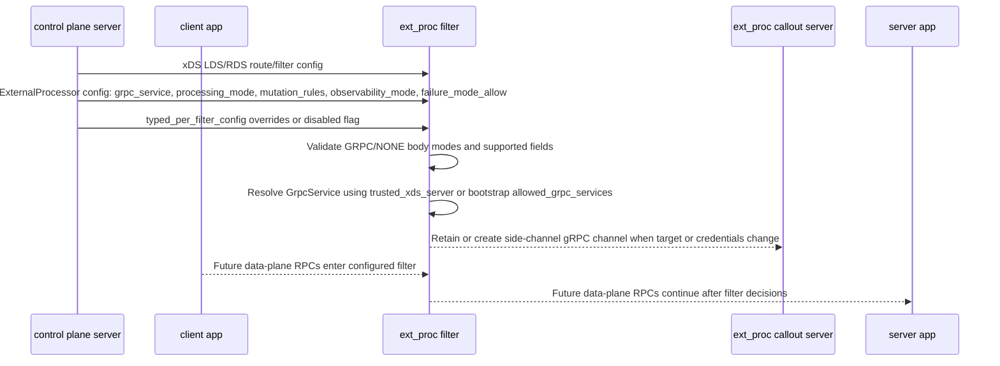

## 2. Client-Side Normal Mode, Full Duplex Request And Response

In this flow, the ext_proc filter runs in the client stack. Header and trailer events are held until the ext_proc response arrives. Message bodies in `GRPC` mode are not passed through directly; the ext_proc callout server returns the serialized messages that should continue on the data-plane stream.

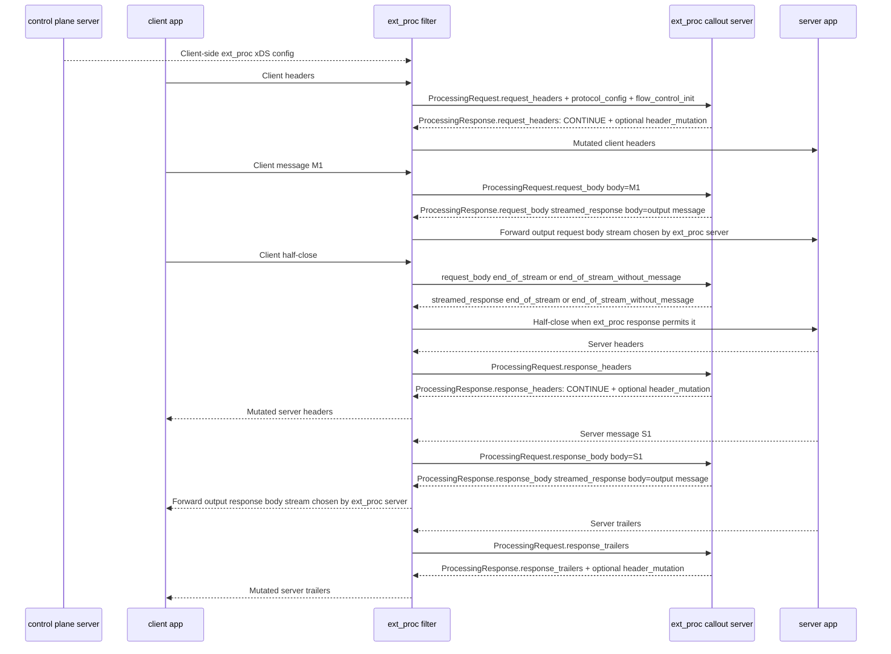

## 3. Server-Side Normal Mode, Full Duplex Request And Response

In this flow, the ext_proc filter runs in the server stack. The same protocol is used, but "downstream" is the transport/client side and "upstream" is the server application.

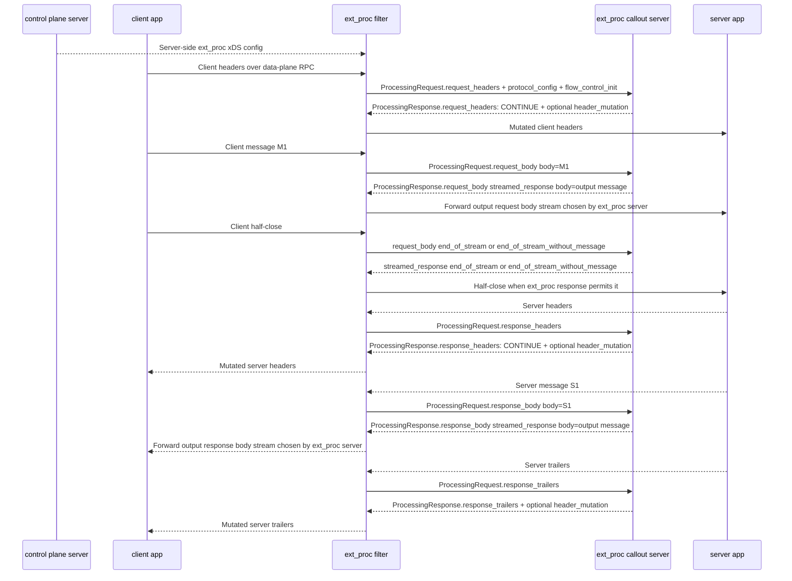

## 4. Observability Mode

In observability mode, events are copied to the ext_proc callout server, but the data-plane RPC does not wait for ext_proc responses and ext_proc responses are not expected to mutate the RPC. The filter still needs flow-control push-back before allowing a message to proceed if the copy to the ext_proc stream cannot pass normal stream flow control.

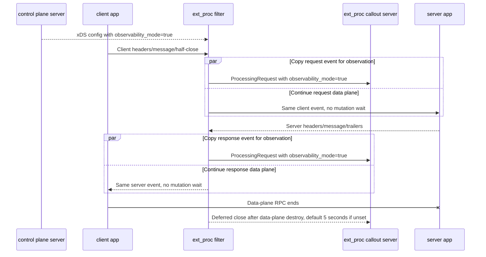

## 5. Headers-Only Request Or Body Mode NONE

If request and response body modes are `NONE`, only configured header and trailer events are sent to ext_proc. This is also the case where `failure_mode_allow=true` can allow the RPC to continue after a non-OK ext_proc failure, because no body stream replacement has begun.

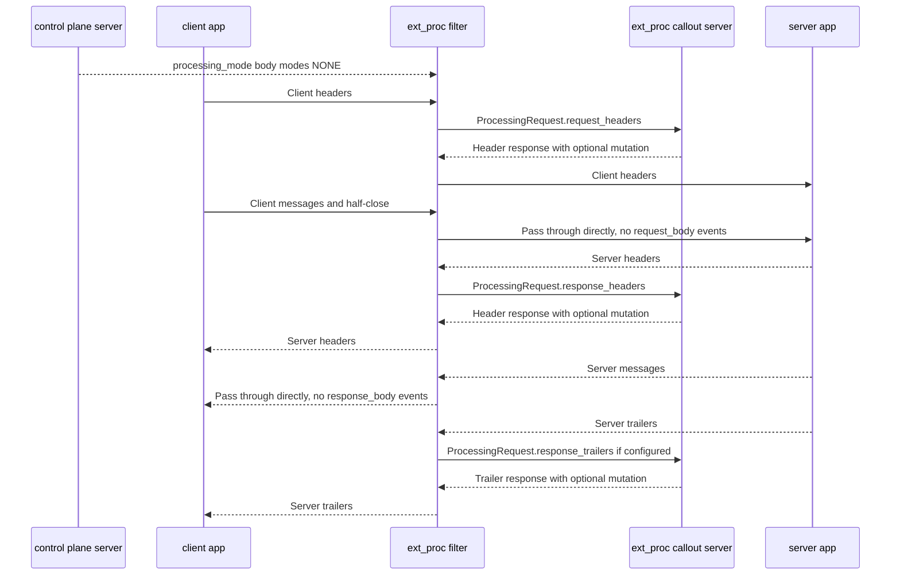

## 6. Trailers-Only Server Response

For a trailers-only response, server headers are represented on the ext_proc stream as `response_headers` with `end_of_stream=true`. No `response_trailers` event is sent for that trailers-only response.

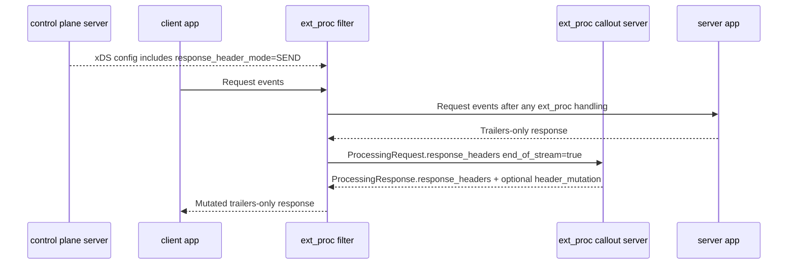

## 7. Immediate Response From ext_proc

The ext_proc server may send `immediate_response` in response to any data-plane event unless `disable_immediate_response=true`. If disabled, the filter treats the ext_proc stream as failed.

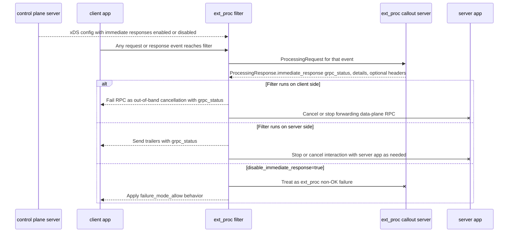

## 8. Non-OK ext_proc Failure

A non-OK ext_proc stream status normally fails the data-plane RPC with `INTERNAL`. With `failure_mode_allow=true`, the RPC may continue only if the filter has not started sending request or response messages to the ext_proc stream.

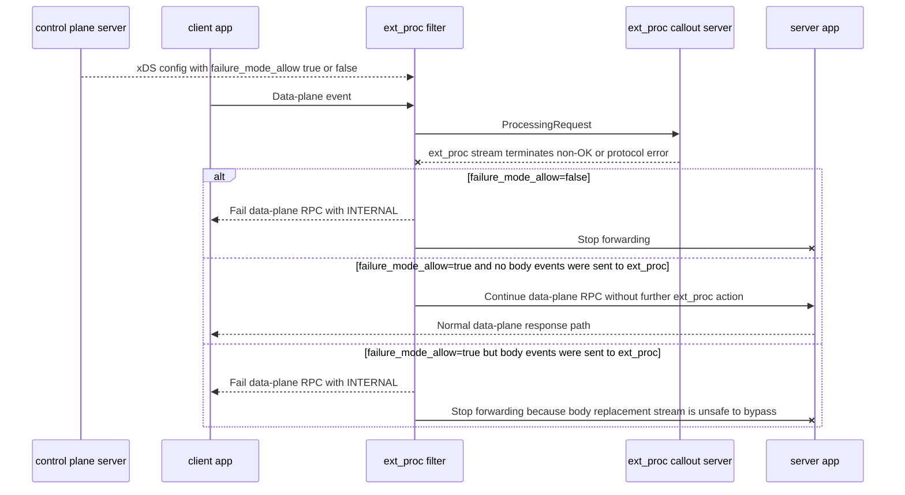

## 9. OK Early Termination Without Drain

If the ext_proc stream ends with OK, the filter stops sending events to ext_proc and lets remaining data-plane events proceed unchanged. This is valid when message body modes are not being used, or when no undrained body messages can be dropped.

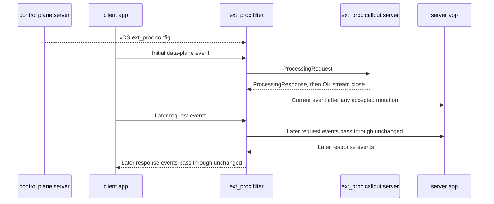

## 10. OK Early Termination With Drain For Body Mode GRPC

If request or response body events are being sent, the ext_proc callout server must drain before OK termination. It first asks for `request_drain`; the filter half-closes the ext_proc stream and stops reading from the data plane so normal flow-control push-back applies. The ext_proc server echoes all received messages, then closes OK. After that, future data-plane messages pass through unchanged.

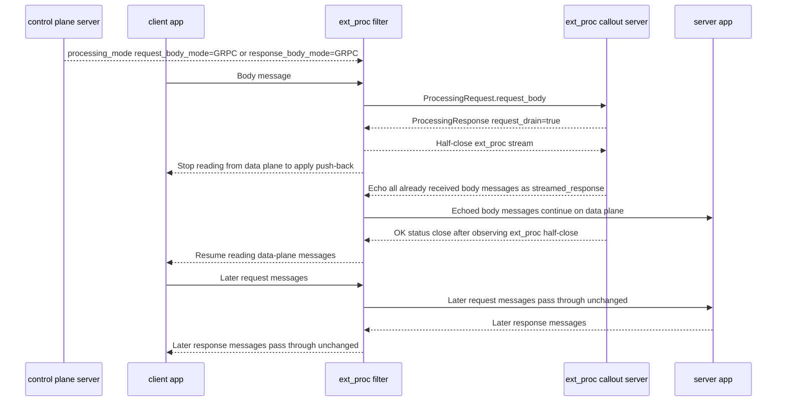

## 11. Client Half-Close Encodings

gRPC request trailers do not exist. A client half-close is represented in request body events.

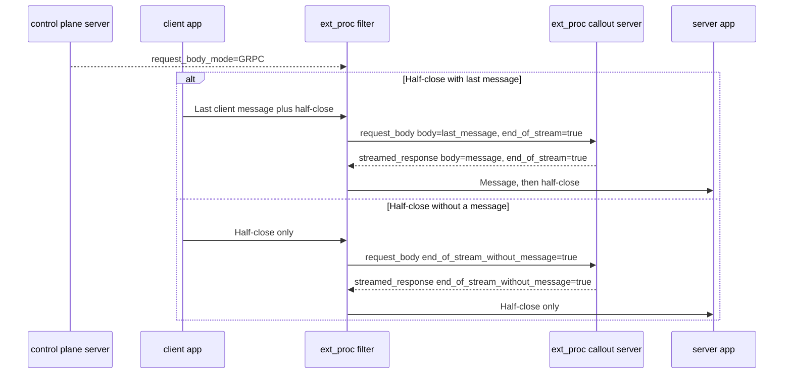

## 12. ext_proc Rewrites Request Message Count

In `GRPC` body mode, the ext_proc callout server owns the resulting body stream. It may drop, replace, or expand messages; the response message count does not need to match the original request message count.
The filter does not match individual `ProcessingResponse.request_body` messages back to specific `ProcessingRequest.request_body` messages.

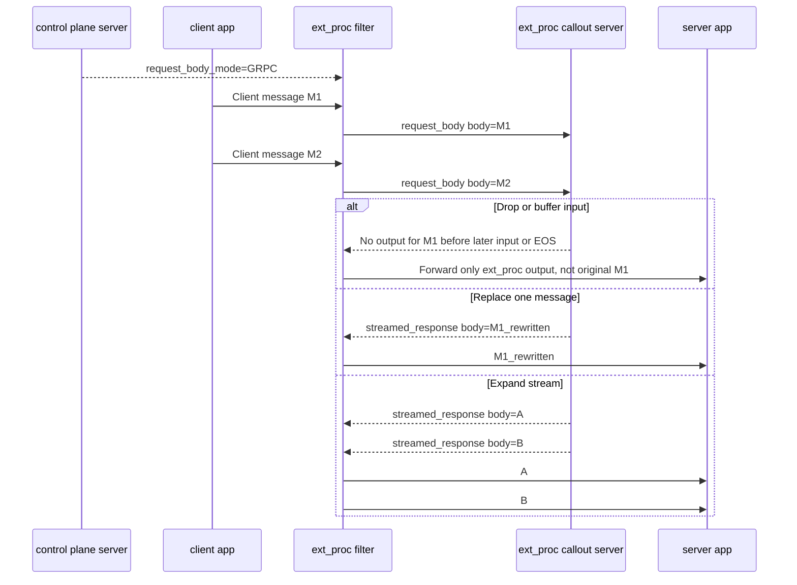

## 13. ext_proc Rewrites Response Message Count

The same body-stream ownership applies to server-to-client messages when `response_body_mode=GRPC`. A valid config with response body mode `GRPC` requires `response_header_mode=SEND`.
The filter forwards the ext_proc output stream and does not require a one-to-one response for each input server message.

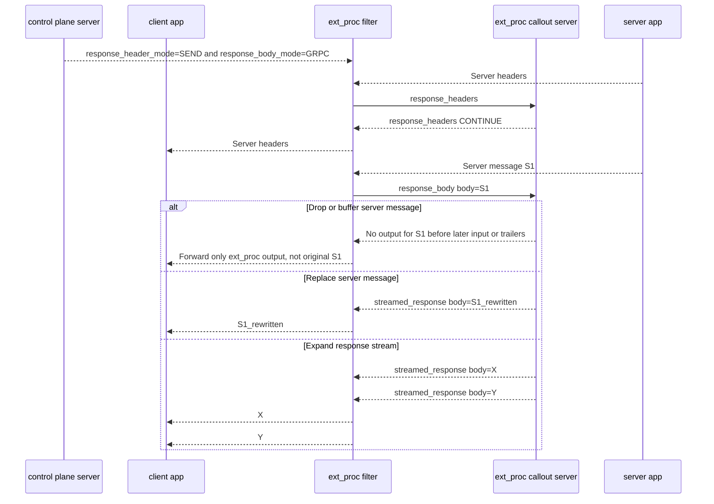

## 14. Protocol Error Or Unsupported Response Field

Several ext_proc responses become protocol failures in gRPC: out-of-order responses, `CONTINUE_AND_REPLACE`, `grpc_message_compressed=true` in a response, invalid header mutation, or other unsupported required semantics.

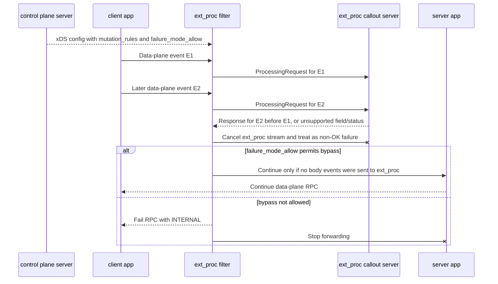

## 15. Four Independent Flow-Control Paths In Normal Mode

The linked flow-control proto adds initial windows and update messages so the four body paths can be pushed back independently. This avoids the deadlock where both body directions would otherwise push back through one ext_proc HTTP/2 stream.

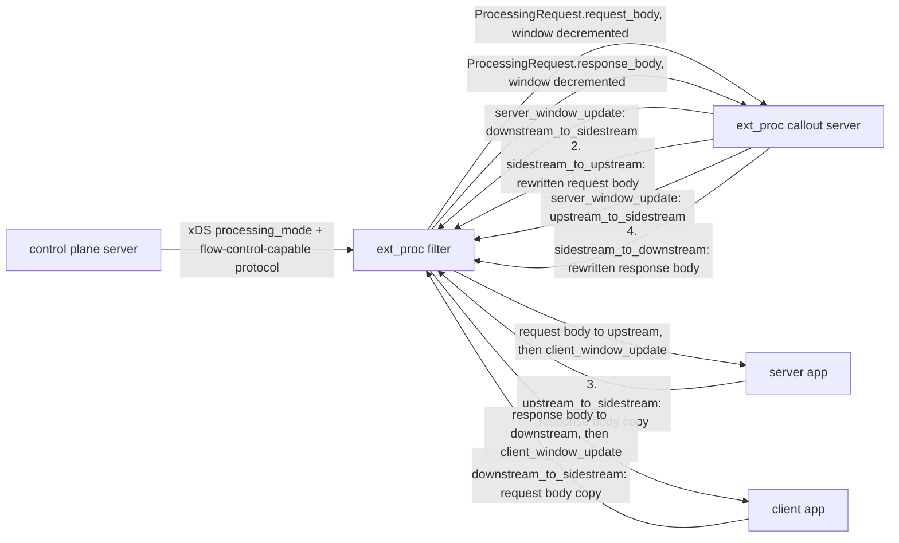

## 16. Compression Interaction

gRPC sends uncompressed serialized messages to ext_proc because the filter is above compression on sends and after decompression on receives. If an ext_proc response sets `grpc_message_compressed=true`, gRPC treats that as an ext_proc failure.

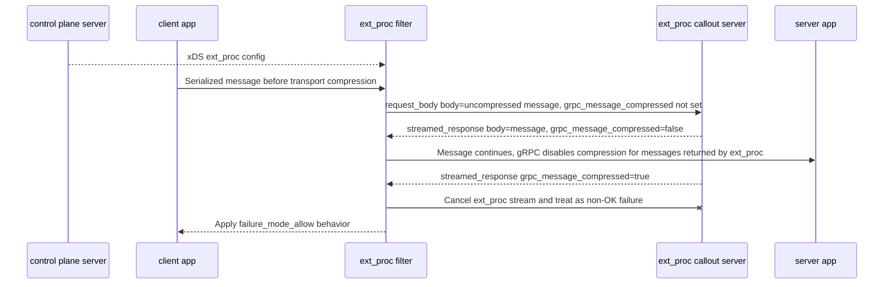
