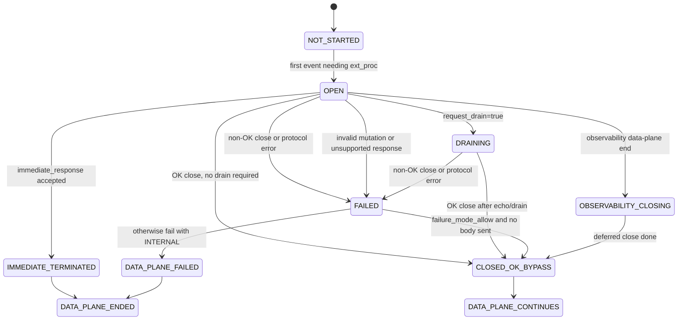
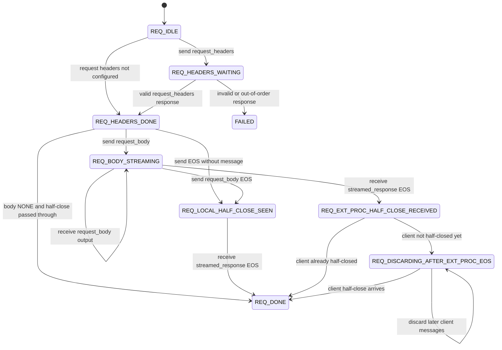
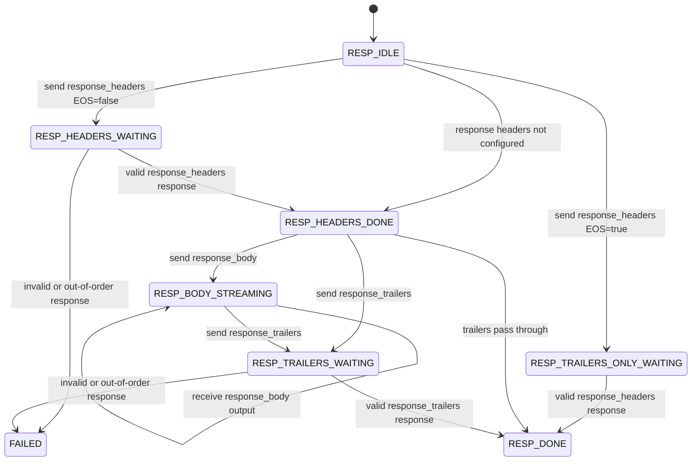
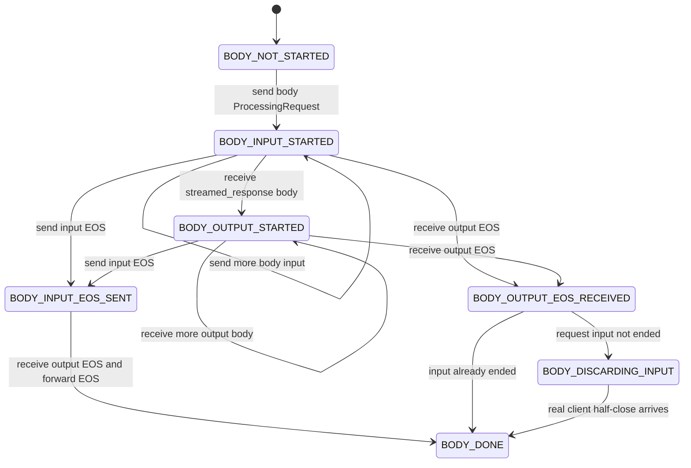
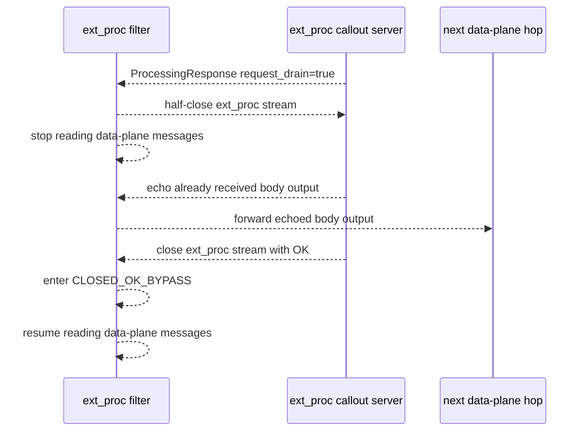

# A93 ext_proc Filter State Machine

This is a concrete implementation-oriented state model for the gRPC A93
ext_proc design. It focuses on `ProcessingRequest` and
`ProcessingResponse` handling, not application-level protobuf semantics.

The important modeling choice is to avoid one giant state enum. A93
allows request-side and response-side events to interleave, while each
direction still has strict ordering. The filter is easier to reason about
as cooperating state machines:

- shared ext_proc stream lifecycle
- request-side event state
- response-side event state
- body transform state per direction
- blocking header/trailer response gates
- flow-control windows

## Shared Stream Lifecycle

```text
NOT_STARTED
  No ext_proc stream exists yet for this data-plane RPC.

OPEN
  The ext_proc stream exists. The filter can send ProcessingRequests and
  receive ProcessingResponses.

HALF_CLOSED_TO_EXT_PROC
  The filter has half-closed the ext_proc stream, normally after receiving
  request_drain=true.

DRAINING
  The filter is waiting for the ext_proc callout server to echo/drain
  already-sent body messages and close with OK.

CLOSED_OK_BYPASS
  The ext_proc stream ended OK. Remaining data-plane events bypass
  ext_proc unchanged.

FAILED
  The ext_proc stream failed, a protocol error occurred, an invalid
  mutation occurred, or an unsupported response was seen.

IMMEDIATE_TERMINATED
  immediate_response was accepted and the data-plane RPC is being
  terminated with the supplied gRPC status.

OBSERVABILITY_CLOSING
  Observability mode only: the data-plane RPC is gone, but the filter
  delays closing the ext_proc stream for deferred_close_timeout.
```



## Global Failure-Mode Flag

The `failure_mode_allow` bypass condition is global across both body
directions. A93 says bypass is allowed only if the filter has not yet
started sending client or server messages to the ext_proc stream.

```text
has_sent_any_body_to_ext_proc =
  has_sent_request_body_to_ext_proc || has_sent_response_body_to_ext_proc
```

On non-OK ext_proc failure:

```text
if failure_mode_allow && !has_sent_any_body_to_ext_proc:
  continue data-plane RPC with no further ext_proc processing
else:
  fail data-plane RPC with INTERNAL
```

## Request Direction State

This tracks client-to-server events and request-body output returned by
the ext_proc callout server.

```text
REQ_IDLE
  No request event has been sent to ext_proc.

REQ_HEADERS_WAITING
  request_headers was sent. The filter is waiting for
  ProcessingResponse.request_headers.

REQ_HEADERS_DONE
  Request headers were accepted/mutated and forwarded, or client headers
  were not configured to be sent.

REQ_BODY_NOT_STARTED
  request_body_mode is GRPC, but no request_body ProcessingRequest has
  been sent.

REQ_BODY_STREAMING
  One or more request_body ProcessingRequests have been sent. ExtProc owns
  the request body output stream.

REQ_LOCAL_HALF_CLOSE_SEEN
  Client half-close has been seen and represented to ext_proc via
  end_of_stream or end_of_stream_without_message.

REQ_EXT_PROC_HALF_CLOSE_RECEIVED
  ExtProc response indicated request-stream EOS should be forwarded
  upstream.

REQ_DISCARDING_AFTER_EXT_PROC_EOS
  ExtProc ended the request stream before the real client half-closed.
  Later client messages must be read and discarded until the client
  half-close arrives.

REQ_DONE
  Request stream half-close has been forwarded to the next hop.

REQ_BYPASS
  ExtProc processing is no longer active for this direction. Pass through
  unchanged.
```



## Response Direction State

This tracks server-to-client events and response-body output returned by
the ext_proc callout server.

```text
RESP_IDLE
  No response event has been sent to ext_proc.

RESP_HEADERS_WAITING
  response_headers was sent with end_of_stream=false. The filter is
  waiting for ProcessingResponse.response_headers.

RESP_HEADERS_DONE
  Response headers were accepted/mutated and forwarded, or server headers
  were not configured to be sent.

RESP_TRAILERS_ONLY_WAITING
  response_headers was sent with end_of_stream=true for a trailers-only
  response.

RESP_TRAILERS_ONLY_DONE
  Trailers-only response was accepted/mutated and forwarded.

RESP_BODY_NOT_STARTED
  response_body_mode is GRPC, but no response_body ProcessingRequest has
  been sent.

RESP_BODY_STREAMING
  One or more response_body ProcessingRequests have been sent. ExtProc
  owns the response body output stream.

RESP_TRAILERS_WAITING
  response_trailers was sent. The filter is waiting for
  ProcessingResponse.response_trailers.

RESP_DONE
  Final server trailers have been forwarded to the client.

RESP_BYPASS
  ExtProc processing is no longer active for this direction. Pass through
  unchanged.
```



## Body Transform State

Each direction with `GRPC` body mode has a body-transform sub-state.
Request and response body states are separate, but both set the global
`has_sent_any_body_to_ext_proc` failure-mode flag.

```text
BODY_DISABLED
  Body mode is NONE.

BODY_NOT_STARTED
  Body mode is GRPC, but no body ProcessingRequest has been sent.

BODY_INPUT_STARTED
  At least one body ProcessingRequest has been sent to ext_proc.

BODY_OUTPUT_STARTED
  At least one body ProcessingResponse streamed_response has been received.

BODY_INPUT_EOS_SENT
  The filter sent end_of_stream or end_of_stream_without_message to ext_proc.

BODY_OUTPUT_EOS_RECEIVED
  ExtProc told the filter to forward EOS for that body stream.

BODY_DONE
  EOS was forwarded to the next data-plane hop.

BODY_DISCARDING_INPUT
  Request direction only: ext_proc ended the request body before the
  client did. Later client input is discarded.
```



## ProcessingResponse Validation

The filter should validate every incoming `ProcessingResponse` against
current shared and directional state. A useful processing pipeline is:

```text
1. Reject responses if the stream is not OPEN or DRAINING.
2. Apply server_window_update if present and flow control is negotiated.
3. If immediate_response is present:
     - handle it if disable_immediate_response=false
     - otherwise treat it as ext_proc failure
4. If request_drain is present, enter DRAINING.
5. Inspect the response oneof:
     - request_headers
     - response_headers
     - request_body
     - response_body
     - response_trailers
6. Validate that the response type is legal for the current directional state.
7. Validate status == CONTINUE where A93 requires it.
8. Reject unsupported CONTINUE_AND_REPLACE.
9. Validate header mutations and mutation_rules.
10. Reject grpc_message_compressed=true in a response body.
11. Apply output effects: mutate headers, forward body output, forward EOS,
    or release a blocked header/trailer gate.
12. Advance the shared, request, response, body, and flow-control states.
```

## Expected Response Matching

A93 requires responses from the ext_proc callout server to come back in
the same order as events sent by the filter. However, body streams are
not one-to-one: the callout server may drop, replace, or expand body
messages.

For implementation, track strict gates for blocking events:

```text
expected_blocking_response:
  NONE
  REQUEST_HEADERS
  RESPONSE_HEADERS
  RESPONSE_TRAILERS
```

Validation rules:

```text
ProcessingResponse.request_headers
  valid only if expected_blocking_response == REQUEST_HEADERS

ProcessingResponse.response_headers
  valid only if expected_blocking_response == RESPONSE_HEADERS

ProcessingResponse.response_trailers
  valid only if expected_blocking_response == RESPONSE_TRAILERS

ProcessingResponse.request_body
  valid only if request_body_mode == GRPC and request body output is active

ProcessingResponse.response_body
  valid only if response_body_mode == GRPC and response body output is active

ProcessingResponse.immediate_response
  valid in response to any data-plane event unless disable_immediate_response=true

ProcessingResponse.request_drain
  valid while stream_state == OPEN

ProcessingResponse.server_window_update
  valid when ext_proc flow control is negotiated
```

The hard part is that event order is strict but body cardinality is not.
In practice:

- a header/trailer response must not be skipped or overtaken
- a body response must not appear before an earlier required header response
- request-body output belongs to the request-body output stream
- response-body output belongs to the response-body output stream
- request and response directions may interleave, but each direction must
  remain legal

## Immediate Response

`immediate_response` is the explicit callout-driven termination mechanism
for the RPC.

```text
Any OPEN state
  -- ProcessingResponse.immediate_response and disable_immediate_response=false -->
     IMMEDIATE_TERMINATED
```

Behavior:

```text
client-side filter:
  fail the client RPC as an out-of-band cancellation with grpc_status/details

server-side filter:
  send trailers to the client with grpc_status/details

if received in response to server trailers:
  set final status and optional trailer headers

if disable_immediate_response=true:
  treat as ext_proc failure
```

gRPC uses `grpc_status`, `details`, and best-effort headers. A93 says the
HTTP `status` and `body` fields are ignored because they do not apply to
gRPC.

## Drain Handling

Drain is used when the ext_proc callout server wants to close OK after
body processing has started.



## Flow-Control State

Normal mode has four independent ext_proc flow-control windows:

```text
window_downstream_to_sidestream
  Original request body copied to ext_proc.

window_sidestream_to_upstream
  ExtProc-produced request body forwarded to the server/upstream.

window_upstream_to_sidestream
  Original response body copied to ext_proc.

window_sidestream_to_downstream
  ExtProc-produced response body forwarded to the client/downstream.
```

Each window tracks:

```text
available_bytes
blocked_queue
eos_pending
```

Window transitions:

```text
send body bytes on a path:
  available_bytes -= body_size

if available_bytes <= desired_send_size:
  block that path

receive window update:
  available_bytes += increment
  unblock if available_bytes permits

GRPC mode exception:
  if available_bytes > 0, sender may send one complete message even if
  message size exceeds available_bytes
```

## Suggested Implementation Shape

```text
ExtProcCallState
  stream_state
  mode_config
  observability_mode
  failure_mode_allow
  disable_immediate_response
  has_sent_any_body_to_ext_proc

  request_state
  response_state

  request_body_state
  response_body_state

  expected_blocking_response
  flow_control_windows
```

The state machine is complex, but the complexity is bounded if state is
split along these lines:

- one shared stream lifecycle
- two directional protocol machines
- body transform sub-state per direction
- independent flow-control windows

